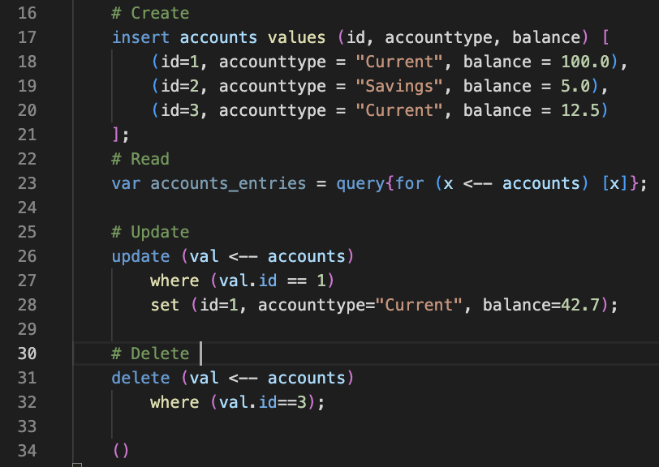
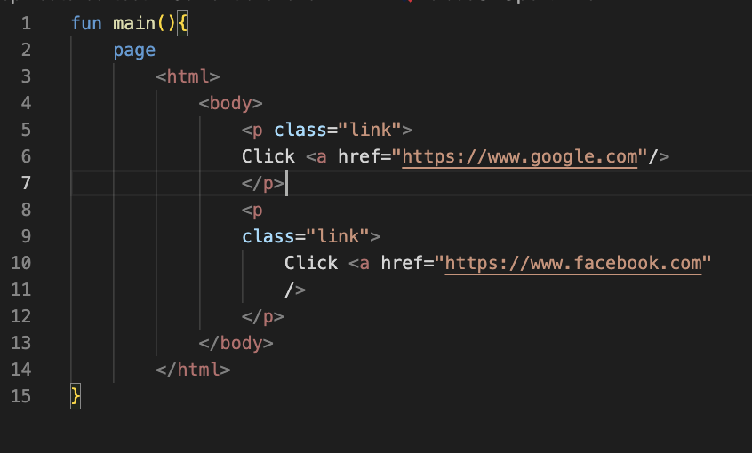
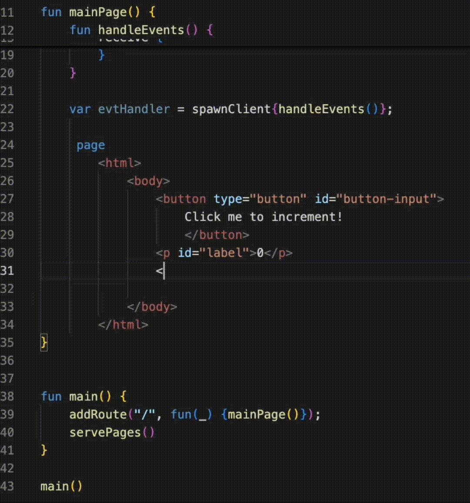
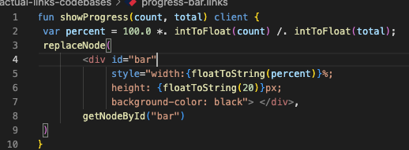
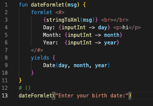
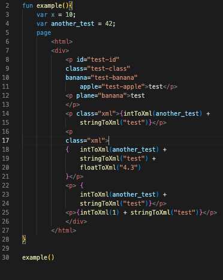

# LinksLSP

This repo contains an implementation of a VSCODE Extension for the programming langauge Links. The original aim of this project was to implement a Language Server Protocol for the language, however, the project has evolved to include extra features to enhance the development experience. This project is made as part of my final year dissertation project at The University of Edinburgh.

## NOTE
To get the token highlighting working, once installed, please change the theme from your theme to `Links Dark'. This is a custom theme specifically setup for Links.

## Features
- VSCode 'Links' area to
    - Check what tables exist in your database
    - Automatic code generation based on table selection
- Code completion on table initialization from a variable of database type
- 'Links' icon
- Execute current code 'button'
- OnReferences for Function implementations and parameters for Variables
- OnDefinition for functions, variables (scope defined and parameter variables)
- Semantic Highlighting in REAL TIME
- Diagnostics for incorrectly used variables/functions
- Unit tests

### Demonstration

## Future plans
More features which typically exist in an LSP will be implemented. This includes capabilities like 'Syntax highlighting' as well as autocomplete, goToFunction definition etc. 

## Developing locally
Since this is a VSCode extension with an LSP, there are two code bases in this repo. The first is the 'client' and the second is the 'server' where Both are written in Typescript. To install dependencies on both, navigate to either `./client` or `./server` and run the command `npm install`.

To test the extension locally, open the code base in VSCode and start the extension from the 'Run and Debug' section.

## Extension Settings

Include if your extension adds any VS Code settings through the `contributes.configuration` extension point.

For example:

This extension contributes the following settings:

* `myExtension.enable`: Enable/disable this extension.
* `myExtension.thing`: Set to `blah` to do something.

## Known Issues

Calling out known issues can help limit users opening duplicate issues against your extension.

## Release Notes

### 11/03/25
- Added new features
    - Document symbols support
    - Errors produced on runtime 

### 04/03/25
- Bug fixes
- Now runs without manually starting <a href="https://github.com/jameBroa/LinksParser">LinksParser</a>
    - To do so, clone repo, have OCaml installed, configure path to parser.ml file in Extension settings
- Added refactoring support for vars/func
- Added onCompletion for var/fun names
- Refactored onCompletion for tables
- Added support for onHover
    - onHover for built-in functions reveals the type
    - onHover for user-defined functions reveal the fun definition and params

### 28/02/25
- Cleaned up a lot of bugs
- Solved problem with XML range information being incorrect for attributes defined by a multiline string

### 21/02/25
- Reworked entire XML Semantic process w/ new AST pipeline
- XML Semantic highlighting supports Formlets AND Blocks (see imgs below)
 

### 16/02/25
- Finished reworking whole pipeline with SemanticTokens finished
- All tests are passing
- Robustness will be tested w/ new pipeline against existing Links files...

### 11/02/25
- Reworked the whole pipeline
- Made it more efficient
- Modularized code
- Added more test cases

#### Known bugs in release
- SemanticTokens don't always work
- SemanticTokens not refactored to support new pipeline
- XML SemanticToken tests fail

---

## Following extension guidelines

Ensure that you've read through the extensions guidelines and follow the best practices for creating your extension.

* [Extension Guidelines](https://code.visualstudio.com/api/references/extension-guidelines)

## Working with Markdown

You can author your README using Visual Studio Code. Here are some useful editor keyboard shortcuts:

* Split the editor (`Cmd+\` on macOS or `Ctrl+\` on Windows and Linux).
* Toggle preview (`Shift+Cmd+V` on macOS or `Shift+Ctrl+V` on Windows and Linux).
* Press `Ctrl+Space` (Windows, Linux, macOS) to see a list of Markdown snippets.

## For more information

* [Visual Studio Code's Markdown Support](http://code.visualstudio.com/docs/languages/markdown)
* [Markdown Syntax Reference](https://help.github.com/articles/markdown-basics/)

**Enjoy!**
